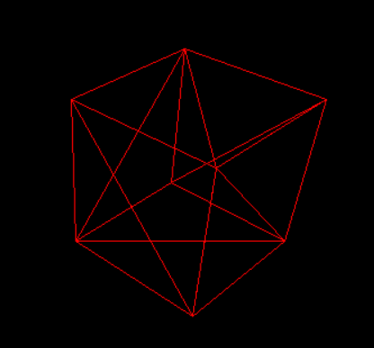

# ScratchRender

3D rendering built from scratch, using SDL2 and cuBLAS.

## Examples

## TODO list
- Camera navigation
- Rasterization
- Shaders

## Bibliography

- https://en.wikipedia.org/wiki/Rotation_matrix
- https://developer.unigine.com/en/docs/latest/code/fundamentals/matrices/index?rlang=cpp
- https://www.scratchapixel.com/
- 
